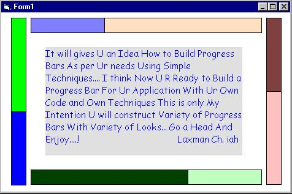



## A Simple Technique Behind Progress Bar

### Description

A simple and cool Progress Bar with SINGLE LINE SOURCE CODE... a simple technique it will gives an idea how to build effective and variety progress bars for your needs... Enjoy...!
 
### More Info
 

             |
---                |---
**Submitted On**   |2004-08-25 01:19:02
**By**             |[Laxman Ch\. iah](https://github.com/Planet-Source-Code/PSCIndex/blob/master/ByAuthor/laxman-ch-iah.md)
**Level**          |Intermediate
**User Rating**    |4.1 (29 globes from 7 users)
**Compatibility**  |VB 4\.0 \(32\-bit\), VB 5\.0, VB 6\.0
**Category**       |[Coding Standards](https://github.com/Planet-Source-Code/PSCIndex/blob/master/ByCategory/coding-standards__1-43.md)
**World**          |[Visual Basic](https://github.com/Planet-Source-Code/PSCIndex/blob/master/ByWorld/visual-basic.md)
**Archive File**   |[A\_Simple\_T1785588252004\.zip](https://github.com/Planet-Source-Code/laxman-ch-iah-a-simple-technique-behind-progress-bar__1-55805/archive/master.zip)

